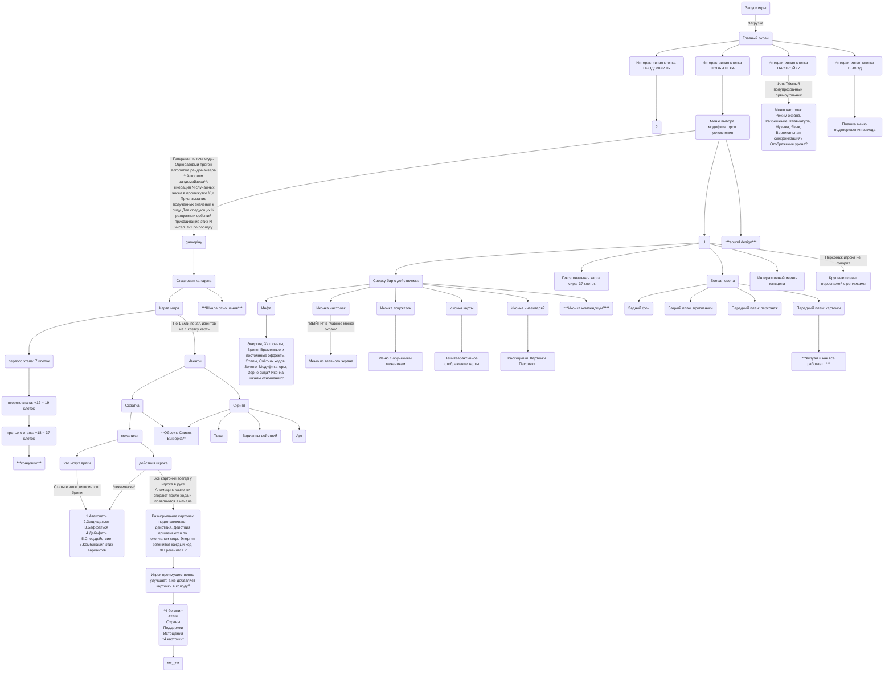

```mermaid
flowchart TD
	AA(Запуск игры) --> |Загрузка| AB(Главный экран)
	AB --> AC(Интерактивная кнопка ПРОДОЛЖИТЬ)
	AB --> AD(Интерактивная кнопка НОВАЯ ИГРА)
	AB --> AE(Интерактивная кнопка НАСТРОЙКИ)
	AB --> AF(Интерактивная кнопка ВЫХОД)
	AC --> AG(?)
	AD --> BA(Меню выбора модификаторов усложнения)
	BA --> |Генерация ключа сида. Одноразовый прогон алгоритма рандомайзера.<br/>**Алгоритм рандомайзера**: Генерация N случайных чисел в промежутке X,Y. Привязывание полученных значений к сиду. Для следующих N рандомных событий присваивание этих N чисел. 1-1 по порядку.| AH(gameplay)
	BA --> AM(UI)
	BA --> BB(***sound design***)
	AE --> |Фон: Тёмный полупрозрачный прямоугольник| AI(Меню настроек:<br/>Режим экрана, Разрешение, Клавиатура, Музыка, Язык, Вертикальная синхронизация? Отображение урона?)
	AF --> AJ(Плашка меню подтверждения выхода)
	AM --> AK(Сверху бар с действиями:)
	AH --> AL(Стартовая катсцена)
	AL --> AN(Карта мира)
	AK --> AX(Инфа)
	AK --> AO(Иконка настроек)
	AK --> AP(Иконка подсказок)
	AK --> AS(Иконка карты)
	AK --> AQ(Иконка инвентаря?)
	AK --> AR(***Иконка компендиум?***)
	AQ --> AZ(Расходники. Карточки. Пассивки.)
	AM --> AT(Гексагональная карта мира: 37 клеток)
	AM --> AV(Боевая сцена)
	AM --> AW(Интерактивный ивент-катсцена)
	AM --> |Персонаж игрока не говорит| AU(Крупные планы персонажей с репликами)
	AX --> AY(Энергия, Хитпоинты, Броня, Временные и постоянные эффекты, Этапы, Счётчик ходов, Золото, Модификаторы, Зерно сида? Иконка шкалы отношений?)
	AO --> |''ВЫЙТИ'' в главное меню/экран?| BC(Меню из главного экрана)
	AP --> BD(Меню с обучением механикам)
	AS --> BE(Неинтеарактивное отображение карты)
	AV --> BF(Задний фон)
	AV --> BG(Задний план: противники)
	AV --> BH(Передний план: персонаж)
	AV --> BI(Передний план: карточки)
	BI --> BJ(***визуал и как всё работает...***)
	AN --> BP(первого этапа: 7 клеток)
	BP --> BK(второго этапа: +12 = 19 клеток)
	BK --> BL(третьего этапа: +18 = 37 клеток)
	AN --> |По 1 \или по 2?\ ивентов на 1 клетку карты| BM(Ивенты)
	BM --> BN(Схватка)
	BM --> BO(Скрипт)
	BL --> BQ(***концовки***)
	AL --> BR(***Шкала отношения***)
	BO --> BS[**Объект: Список<br/>Выборка**]
	BO --> BT(Текст)
	BO --> BU(Варианты действий)
	BO --> BV(Арт)
	BN --> BW(механики:)
	BN --> BS
	BW --> BX(что могут враги)
	BW --> BZ(действия игрока)
	BX --> |Статы в виде хитпоинтов, брони| BY(1.Атаковать <br/>2.Защищаться <br/>3.Баффаться <br/>4.Дебафать <br/>5.Спец.действие <br/>6.Комбинация этих вариантов)	
	BZ --> |*технически*| BY
	BZ --> |Все карточки всегда у игрока в руке<br/>Анимация: карточки сгорают после хода и появляются в начале| CA(Разыгрывание карточек подготавливают действия. Действия применяются по окончании хода. Энергия регенится каждый ход. ХП регенится ?)
	CA --> CB(Игрок преимущественно улучшает, а не добавляет карточки в колоду?)
	CB --> CC(*4 богини:*<br/>Атаки<br/>Охраны<br/>Поддержки<br/>Истощения<br/>*4 карточки*)
	CC --> CD(***...***)
```